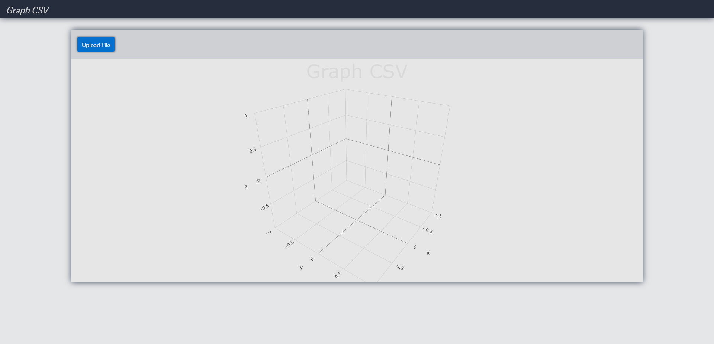
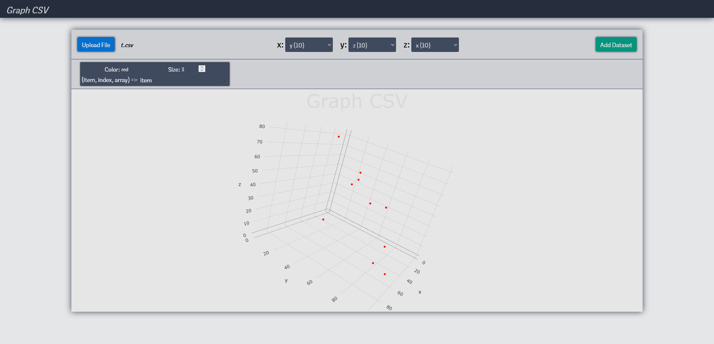

# GraphCSV

This repository contains a simple and efficient tool to visualize numerical data from CSV files in a 3D coordinate system. The goal is to provide an easy-to-use solution for exploring and understanding complex datasets.

## Features

- **CSV file upload**: The tool accepts CSV files with only numerical values. Ensure your file follows this format before uploading.
- **Column selection**: Choose any 3 columns from your CSV file to represent the X, Y, and Z axes in the 3D coordinate system. These columns will be used to plot your data points.
- **3D visualization**: The selected data is displayed as points in a 3D space, allowing you to explore and analyze your data in a more intuitive way.
- **Color customization**: Add colors to the data points based on specific criteria or logic to help identify patterns and trends in the dataset more easily.

## Usage

1. Clone the repository and follow the installation instructions provided in the README file.
2. Run the application locally or host it on a server.
3. Upload a CSV file containing only numerical values.
4. Select 3 columns from your CSV file to represent the X, Y, and Z axes.
5. Enjoy the 3D visualization of your data and customize it using the colorization options.

Node Version: 16.10.0
NPM Version: 7.24.0